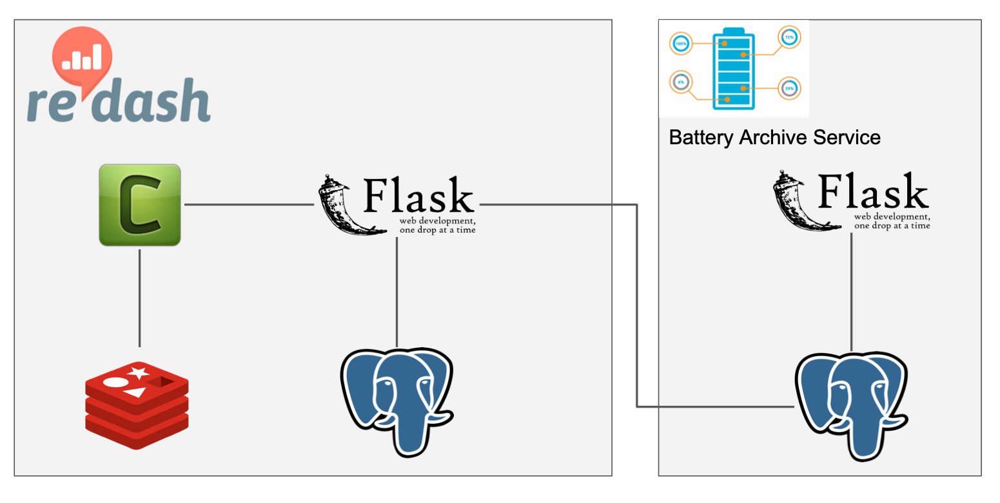

# __Battery Lifecycle (BLC) Framework__

The Battery Lifecycle (BLC) Framework is an open-source platform that provides tools to visualize, analyze, and share battery data through the technology development cycle, including data from material characterization, cell testing, manufacturing, and field testing. The BLC framework provides users with a unified view of their data that they can use to optimize materials and cell configurations, validate cell performance under application conditions, and mitigate manufacturing variations and field failures. BLC has four components: data connectors, data storage, data visualizations, and data processor. BLC supports multiple users with different access permissions. Instead of building the system from the ground up, we developed BLC visualization around Redash, a robust open-source data visualization engine. BLC has been deployed for two applications: (i) tracking the development of a single battery technology from the lab to a manufacturing line and systems installed in the field, and (ii) comparing studies of multiple cells of the same battery chemistry and configuration. The latter implementation is publicly available at www.BatteryArchive.org. 

The code and documentation in this repository can be used to build and operate a site like batteryarchive.org.

To learn more about the design of the software, read our paper available online at https://ecsarxiv.org/h7c24/

For more information, contact us at info@batteryarchive.org.


## System Diagram



## How To's

#### Note for Windows Users
[Windows Subsystem for Linux (WSL) ](https://docs.microsoft.com/en-us/windows/wsl/)

[Docker for WSL](https://docs.microsoft.com/en-us/windows/wsl/tutorials/wsl-containers)

[BASH for Windows](https://docs.microsoft.com/en-us/learn/paths/shell/)


### Deploy Battery Archive Service with Redash (production) 


Open New BASH Terminal
```bash
./bin/setup # run once to build relevant images and configs, re-running will regenerate auth for redash database
./bin/start # launches all services: redash, bas-db, bas-server
./bin/add_queries scripts/redash_queries  #add queries to redash UI
./bin/add_data tests/payloads/localdata.json # add testdata into battery archive database 
```

`Host = 0.0.0.0`

| Port      | Description |
| ----------- | ----------- |
| 1080  | Swagger Docs       |
| 4000  | Battery Archive Service        |
| 26543 | PgAdmin|
| 5000  | Redash UI


### Testing & Development Commands  

Below are commands that are helpful when developing Battery Archive

### Run Battery Archive Service (independently)

Single line joint command to build image and launch BAS API Server and BAS DB

```
docker build . -t bas-prod --target prod && docker run -p 4000:4000 -v $(pwd):/bas --rm  bas-prod
```

Battery Archive Service is runnning
at `0.0.0.0:4000/`


#### Run Battery Archive Service Test Suite 

Single line joint command to build image and run pytests

```
docker build . -t bas-test --target test && docker run bas-test
```

#
Copyright 2021 National Technology & Engineering Solutions of Sandia, LLC (NTESS). Under the terms of Contract DE-NA0003525 with NTESS, the U.S. Government retains certain rights in this software.

